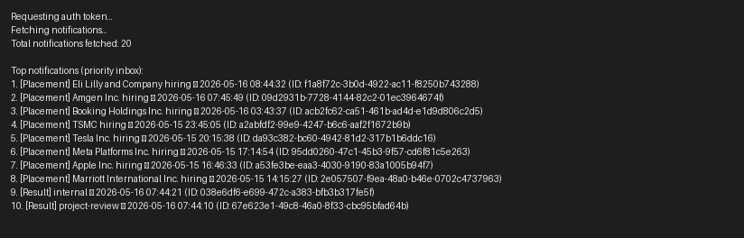

# Campus Notifications — Priority Inbox (Afford Test)

Brief, focused repo overview and quick-run instructions.

## What this repo contains
- `logging_middleware/` — reusable Node logging helper (Log function) that posts to the evaluation Log API.
- `notification_app_be/` — backend folder (contains Stage 1 artifacts under `stage1/`).
- `notification_app_fe/` — Next.js frontend scaffold (runs on `http://localhost:3000`).

## Stage 1 — Priority Inbox (completed)
- Implementation: `notification_app_be/stage1/priority_inbox.py` — authenticates, fetches notifications, and computes top-10 by weight+recency using a fixed-size min-heap for streaming efficiency.
- Design doc: [notification_app_be/stage1/Notification_System_Design.md](notification_app_be/stage1/Notification_System_Design.md)
- Console output (captured):



Quick run (Python 3.8+):

```bash
python notification_app_be/stage1/priority_inbox.py
```

Output is saved to `notification_app_be/stage1/output.txt` and a screenshot `notification_app_be/stage1/console_output.png` was committed.

## Frontend (Stage 2) — Next.js scaffold
- Location: `notification_app_fe/`
- Run locally:

```bash
cd notification_app_fe
npm install
npm run dev
```

- Pages:
	- `/` — All notifications (mark as viewed stored in `localStorage`).
	- `/priority` — Priority Inbox page (query params: `?n=10` and `?type=Placement|Result|Event`).

Notes:
- The server-side pages read the token saved at `notification_app_be/stage1/token.json` to call the protected Notifications API.
- `logging_middleware` should be used for all log calls instead of console logging.

## Files of interest
- `notification_app_be/stage1/priority_inbox.py`
- `notification_app_be/stage1/Notification_System_Design.md`
- `logging_middleware/index.js`
- `notification_app_fe/pages/index.js` and `notification_app_fe/pages/priority.js`


